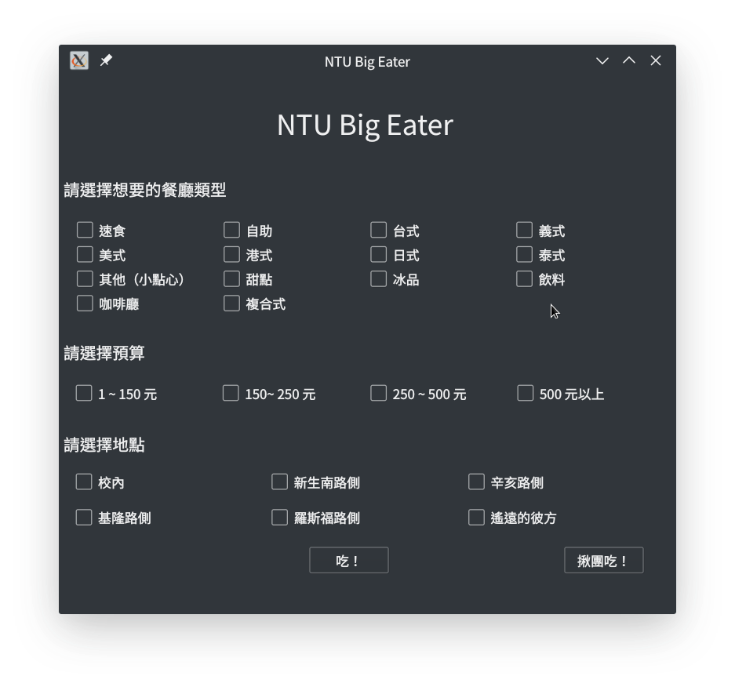
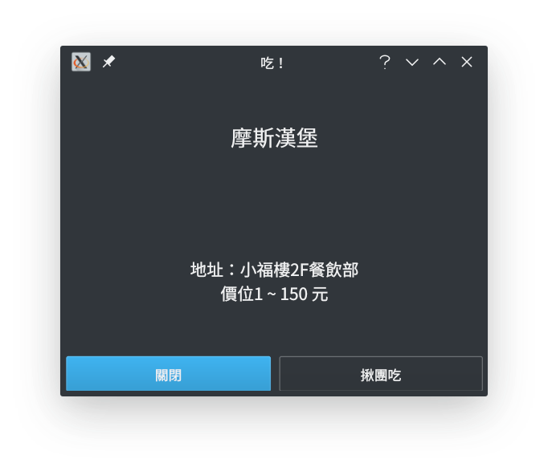
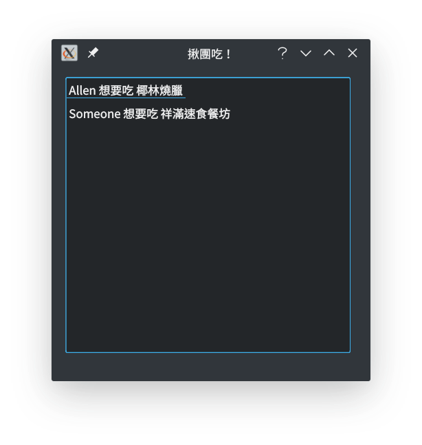

# NTU Big Eater
It's always a pain to decide what to eat for lunch, so here's the lunch decider for NTU !

## Client
The client is written in C++ using Qt framework. It simply shows a panel to let the users check what they prefer, and the program will randomly choose a restaurant nearby.  
  
  
  
If the user want to enjoy lunch with others, he or she can post the request and other users can see it!

## Server  
A simple HTTP server to handle team up request.  
The code is from the post [Lightweight HTTP Server in less than 40 Lines on libevent and C++11](https://kukuruku.co/post/lightweight-http-server-in-less-than-40-lines-on-libevent-and-c-11/) and modified to meet our needs.

## Appreciation
This is the final project for the course Programming Design at Dept. of Information Management, National Taiwan University. I highly appreciate my teammates works and thanks the professor, I won't be able to finish this project without their help.  